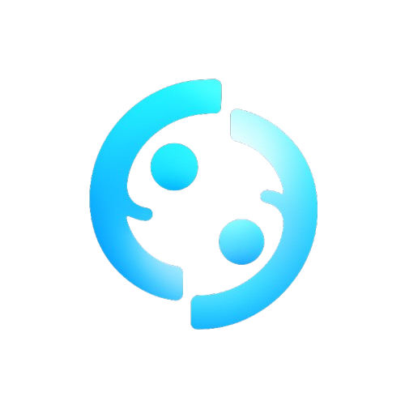

# ♻️ Circlo

> **Rent what you need. Share what you don't.**

Welcome to **Circlo** — the peer-to-peer rental marketplace where your garage becomes a treasure chest, your community becomes your network, and every rental is a win for the planet! 🌍

---

## 🚀 What is Circlo?
Circlo is a vibrant platform designed to power the circular economy. Here, you can rent out items you rarely use, borrow what you need, and even discover cultural artifacts in the **Cultural Vault**. Every transaction helps reduce waste, save money, and build a more connected, sustainable world.

### Why "Circlo"?
Because we believe in circles: sharing, cycling, and sustainability. The "o" is a symbol of completeness, community, and the endless loop of giving and receiving.

---

## ✨ Features
- **Peer-to-Peer Rentals:** List your items or rent from neighbors — from power tools to pottery wheels.
- **Cultural Vault:** Share and discover heritage items, preserving stories across generations.
- **CO₂ Counter:** Track the positive environmental impact of every rental.
- **Community First:** Built to connect, empower, and reward local communities.
- **Modern UI:** Powered by Next.js, React, Tailwind CSS, and Radix UI for a beautiful, accessible experience.

---

## 🌱 Our Mission
Circlo was founded by sustainability enthusiasts and community builders. Our mission is to:
- Reduce waste and overconsumption
- Build stronger, more connected communities
- Preserve and share cultural heritage

---

## 🛠️ Tech Stack
- **Framework:** Next.js + React + TypeScript
- **Styling:** Tailwind CSS (with custom themes & animations)
- **UI Components:** Radix UI, custom components, and more

---

## 🏁 Getting Started

 **Open [Circlo](https://circlo-gamma.vercel.app/) and start sharing!**

---

## 🌍 Impact (So Far)
- **15,000+** items shared
- **8,500+** community members
- **$250,000+** earned by users
- **Thousands of kg CO₂ saved** (and counting!)

---

## 🤝 Join the Circle
- **Browse items:** `/explore`
- **List your item:** `/list-item`
- **Learn more:** `/about`

Ready to make an impact? **Join Circlo and start sharing today!**

---

## 📄 License
MIT (or your preferred license)

---

> _"Sharing is the new owning. Let's build a better world, one rental at a time."_
